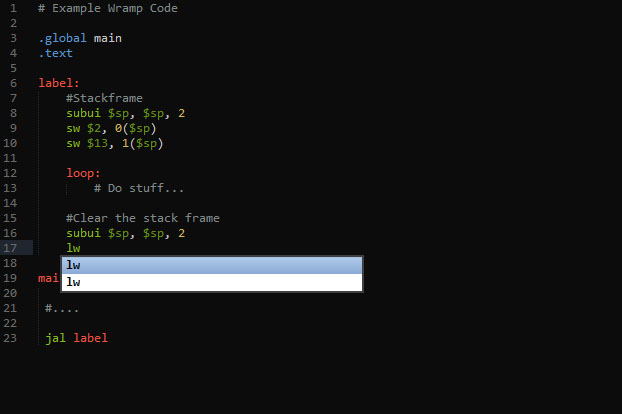
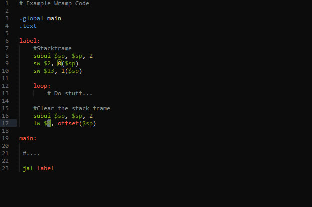

# WRAMP Assembly Language #

## Description ##
WRAMP is a language created by the University of Waikato to enable it's students to learn about assembly programming. This package attempts to help these students
by providing them with code highlighting and completion.

## Screenshots ##

## Installation ##
- Go to [Package Control](https://packagecontrol.io/) and follow the install instructions for the package manager.

- Then inside Sublime, Open the command palette, and type `pc: install`

- Then press enter, and type `wramp`

- Press enter again, and you are finished!

**NOTE**: *This was not created by the staff of the University of Waikato, only by a curious student.*
